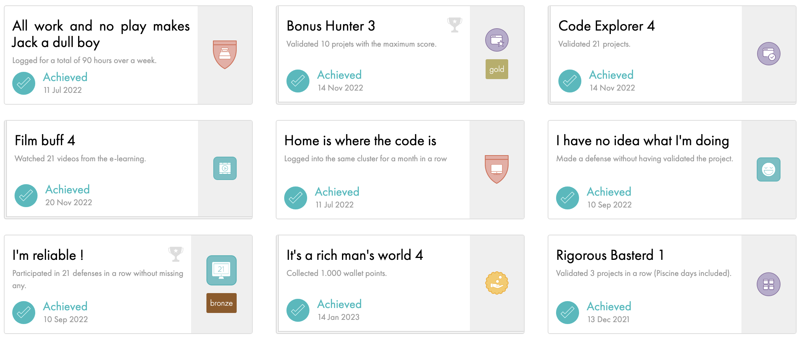

<h1>Hi there 👋</h1>

🔭 I'm currently on my journey in [school 42](https://42yerevan.am/) 

### 🛠 &nbsp;Languages and Tools
[biophython](https://upload.wikimedia.org/wikipedia/commons/1/13/Biopython_logo.png)
[python](https://www.ntuclearninghub.com/documents/51786/4216795/Python-Symbol.png/369e410e-a90f-f887-c2dc-61f7ef761476?t=1679043970578)
### 🌌  &nbsp; 42's achievements

<!--
**symatevo/symatevo** is a ✨ _special_ ✨ repository because its `README.md` (this file) appears on your GitHub profile.

Here are some ideas to get you started:

- 🔭 I’m currently working on ...
- 🌱 I’m currently learning ...
- 👯 I’m looking to collaborate on ...
- 🤔 I’m looking for help with ...
- 💬 Ask me about ...
- 📫 How to reach me: ...
- 😄 Pronouns: ...
- ⚡ Fun fact: ...
-->

